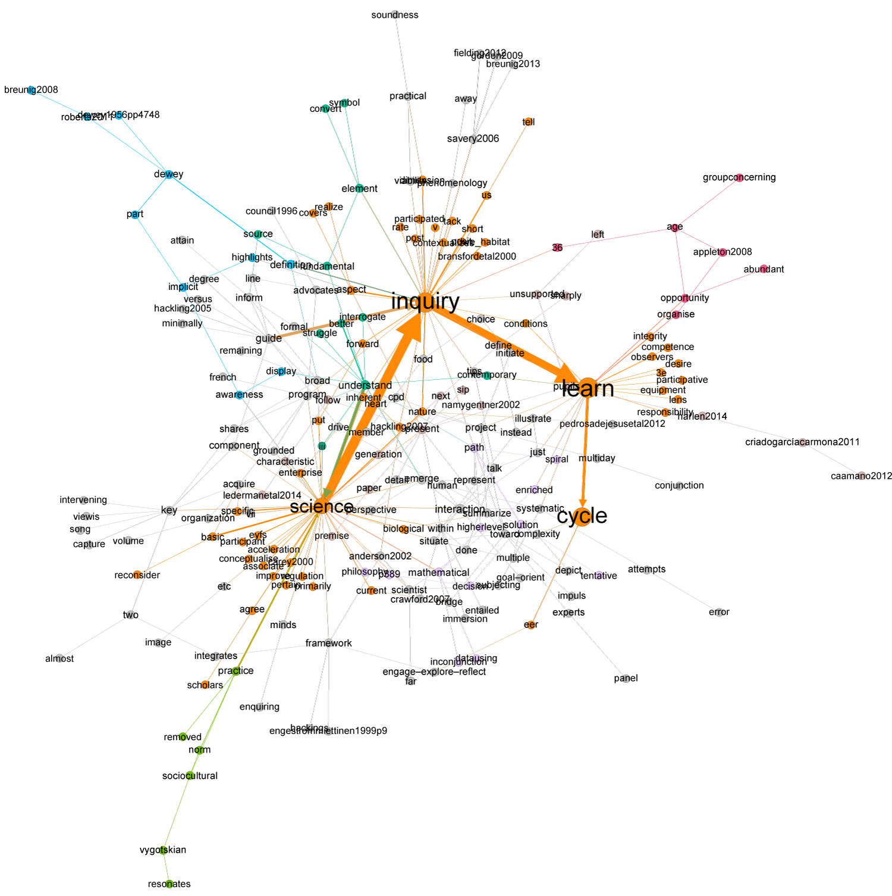
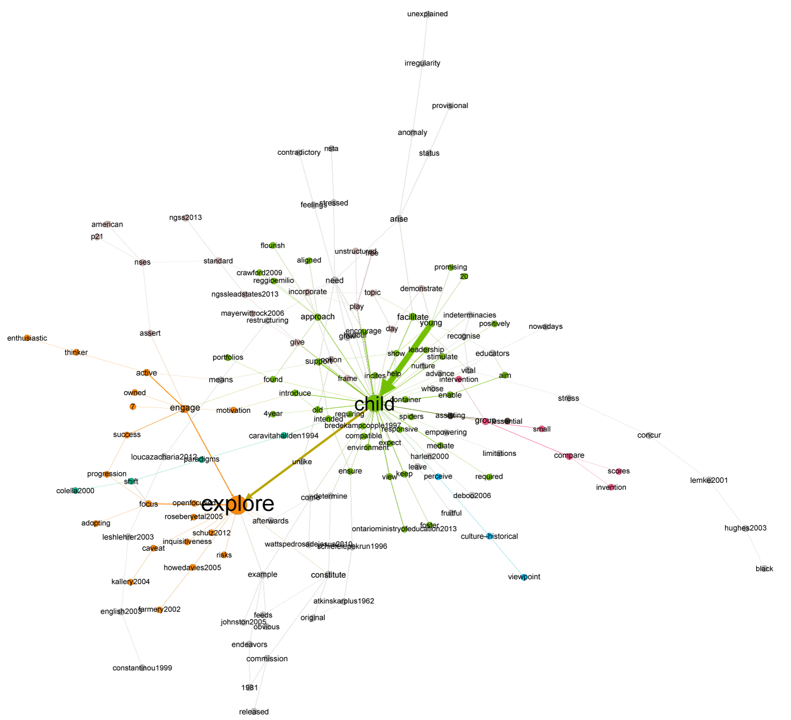

```{r setup, include=FALSE}
knitr::opts_chunk$set(echo = TRUE)
```
This document shows how to make networks and maps found in the main article:

Authors (in review). Identification of positions in literature using Thematic Network Analysis: The case of early childhood inquiry-based science education.*International Journal of Research and Method in Education.*

It represents only the technical sides of what is called Thematic Network Analysis (TNA) in the main article. Full application of the method will require authors to make choices about which words to filter out, which words are seen as synonymous, possible words to concatenate, and words to possibly split. 

In doing TNA using this work flow, researchers need to type in their choices in the file *substitutions.r* file found in the *scripts*-folder. Then, they may run this script, analyse the outcome as described in the main article, and reiterate if necessary. 


### Functions
First, we load the necessary libraries and functions. 

```{r libraries and functions, include=T, message=F}
library(tm)
library(igraph)
source("functions/backboneExtraction.R")
source("functions/mywordnetwork.r")
source("functions/makemap.r")

```
Libraries *tm* and *igraph* are R-libraries for working with text mining and networks. The Backbone extraction function implements the LANS algorithm (Foti et al 2011). 
The function *myWordNetwork* converts texts to networks, while *makemap* converts a network to a map based on results from community detection.  

### Pre-process
First, we use the standard pre-processing tools from the tm-package.
```{r tm-pre-process, include=T}
allTheoretical <-Corpus(DirSource("texts", encoding="UTF-8"), 
                        readerControl = list(language="lat")) 
#Perform basic text-mining preprocessing
allTheoretical<-tm_map(allTheoretical,tolower)
allTheoretical<-tm_map(allTheoretical,removePunctuation)
allTheoretical<-tm_map(allTheoretical,stripWhitespace)
```

Then, we make call the substitution script. This script contains all the algorithmic rules we have decided upon as part of our thematic network analysis. In terms of coding, these rules take the form of substitutions. 

```{r sub-pre-process, include=T}
source("scripts/substitutions.r")
```

Finally, we make a list of the words we want to remove, when we make networks. 

```{r rem-pre-process,include=T}

#These words either provide no meaning or are used so many times 
#that they obscure relevant signals.

wordstoremove<-c(stopwords("english"),"can","also","although","may","maybe","moreover",
                 "mostly","onto","per se", "really","therefore","though","thus",
                 "xl011","xl021","xl051","xl071","xn011","xn031","xn051","xn071",
                 "xq011","xq031","xq041","xq051","xs021","xs091","xs111","xs121",
                 "2013appendixfp10","20132014","1b","p234","p141")

#Cleaning up - substitutions and removals may have produced extra white spaces
allTheoretical<-tm_map(allTheoretical,stripWhitespace)
```

### Make Nework
Now, we use igraph and myWordNetwork to create a network for each theoretical excerpt. First, myWordNetwork is used to make a set of two-column *edge lists*. Then igraph is used to convert each edge list to a network object. 
```{r make-networks, include=T}
edgelistsTheoretical<-lapply(allTheoretical,myWordNetwork,j.words=wordstoremove)
graphsTheoretical<-list()
for (i in 1:35){
  graphsTheoretical[[i]]<-graph.edgelist(edgelistsTheoretical[[i]],directed=T)
} 

edgelistsTheoretical[[1]][1:10,]
plot(graph.edgelist(edgelistsTheoretical[[1]][1:10,],directed=T))

```

Above, we have plotted shown the first ten rows of the first graph and shown the corresponding part of that network. The full first graph contains `r vcount(graphsTheoretical[[1]])` words and `r ecount(simplify(graphsTheoretical[[1]]))` unique directed links. 

Next, we bind all 35 theoretical excerpts to a single edge list. We then create a network from that combined file.

```{r bind-networks-to-one, include=T}

#Bind all excerpts together to a single edge list

allEdgeTheoretical<-rbind(edgelistsTheoretical[[1]],edgelistsTheoretical[[2]],
                          edgelistsTheoretical[[3]],edgelistsTheoretical[[4]],
                          edgelistsTheoretical[[5]],edgelistsTheoretical[[6]],
                          edgelistsTheoretical[[7]],edgelistsTheoretical[[8]],
                          edgelistsTheoretical[[9]], edgelistsTheoretical[[10]],
                          edgelistsTheoretical[[11]],edgelistsTheoretical[[12]],
                          edgelistsTheoretical[[13]],edgelistsTheoretical[[14]],
                          edgelistsTheoretical[[15]],edgelistsTheoretical[[16]],
                          edgelistsTheoretical[[17]],edgelistsTheoretical[[18]],
                          edgelistsTheoretical[[19]],edgelistsTheoretical[[20]],
                          edgelistsTheoretical[[21]], edgelistsTheoretical[[22]],
                          edgelistsTheoretical[[23]],edgelistsTheoretical[[24]],
                          edgelistsTheoretical[[25]],edgelistsTheoretical[[26]],
                          edgelistsTheoretical[[27]],edgelistsTheoretical[[28]],
                          edgelistsTheoretical[[29]],edgelistsTheoretical[[30]],
                        edgelistsTheoretical[[31]],edgelistsTheoretical[[32]],
                        edgelistsTheoretical[[33]],edgelistsTheoretical[[34]],
                        edgelistsTheoretical[[35]])
#Make a single network
allNetTheoretical<-graph.edgelist(allEdgeTheoretical,directed=T)
#Each link is set to have a weight of 1
E(allNetTheoretical)$weight<-1
```

Theoretical excerpts come from different parts of the each article. We have used the word "break" to indicate that to text passages were *not* connected in the article. Thus, when we remove the word "break", we remove any artificial connections between the last word of one text passage and the first word of another. 
```{r remove-break, include=T}
#We have used "break" to indicate
allNetTheoretical<-delete.vertices(allNetTheoretical,
                                   v = which(V(allNetTheoretical)$name=="break"))
```
We simplify the graph by removing self-loops (words linking to themselves) and by combining multiple directed links to one (and summing weights). Thus, if there are $n$ connections between a word $A$ and a word $B$, then we reduce the number of connections to 1 but give that one connection a weight (thickness) of $n$. 
```{r simplify-network, include=T}
allNetTheoretical<-simplify(allNetTheoretical,remove.loops = T,remove.multiple=T,
                            edge.attr.comb=list(weight="sum"))
```
We use PageRank algorithm (Brin & Page, 1998) as an alternative to frequency when finding prominent words. PageRank gauges prominence by considering links between words on a whole-network level. 

We use fast and greedy community detection to find community structure. However, to make sure that we find the same groups consistently, we run the algorithm $N=1000$ times and compare using normalized mutual information (NMI) (Danon et al (2005). For NMI=1 there is no difference between groupings. 

```{r pagerank-community-detection, include=T}
prT<-page.rank(allNetTheoretical)
V(allNetTheoretical)$pr<-prT$vector
fgT<-matrix(0,nrow=1000,ncol=vcount(allNetTheoretical))
for(i in 1:1000){
  fgT[i,]<-fastgreedy.community(as.undirected(allNetTheoretical))$membership
}

comp<-function(j,M){
  #M is a matrix
  nmi<-vector()
  for(i in 1:nrow(M)){
    nmi[i]<-compare(M[i,],M[j,],method="nmi")  
    
  }
  return(nmi)  
} 

nmiM<-matrix(data=0,nrow=1000,ncol=1000)
for(i in 1:1000){
  nmiM[i,]<-comp(i,fgT)
  
}


```
We find that a mean NMI of `r mean(nmiM)`, so we are reasonably sure that the partition is stable. However, the modularity, for this network is Q =  `r max(fastgreedy.community(as.undirected(allNetTheoretical))$modularity)`, which is only marginally signifies community structure. This is likely because of many weak connections. 

We can inspect the groups in terms of number of words in each group: 
```{r groups, include=TRUE} 
table(fastgreedy.community(as.undirected(allNetTheoretical))$membership)
```
So the first identified group has 144 words, the second 195, and so on. It seems that a number of the groups have only few nodes in them and therefore may not be meaningful. 

To get a clearer signal, we will use backbone extraction. This will highlight prominent connections and create more clearly defined groups. 

### Create Maps
First, we prepare the network. This includes calculating the frequencies of each word to be used in later visual analyses. Then we, run the backbone extraction algorithm. This will reduce the number of links. In this case, the algorithm also results in a number of islands and a large component. The PageRanks and frequencies of these islands are small, and the words are not meaningful, we exclude them from the analysis. 
```{r make-backbone, include=T}
V(allNetTheoretical)$id<-V(allNetTheoretical)$name
freq<-strength(allNetTheoretical,mode = "all")

theoreticalBB<-backboneNetwork(allNetTheoretical,evalFunc = 1, alpha = 0.001)
compBB<-components(theoreticalBB)
#Here we add the original frequencies of words
V(theoreticalBB)$freq<-strength(allNetTheoretical,mode = "all")
#Calculate the PageRank
V(theoreticalBB)$pr<-page.rank(theoreticalBB)$vector
#Look at nodes not in main component of network
V(theoreticalBB)$name[compBB$membership!=1]
V(theoreticalBB)$freq[compBB$membership!=1]
V(theoreticalBB)$pr[compBB$membership!=1]
#Choose to work only with largest component
theoreticalBB<-decompose.graph(theoreticalBB)[[1]]
```

The resulting network consists of `r vcount(theoreticalBB)` words and `r ecount(theoreticalBB)` directed links. We now check that we can find clusters conistently use that grouping of words in our work. 

```{r find-clusters, include=T}
####Check that we can find consistent solutions
fgTBBm<-matrix(0,nrow=100,ncol=vcount(theoreticalBB))
for(i in 1:100){
 fgTBBm[i,]<-fastgreedy.community(as.undirected(theoreticalBB))$membership
}

nmiM<-matrix(data=0,nrow=100,ncol=100)
for(i in 1:100){
  nmiM[i,]<-comp(i,fgTBBm)
  
}

mean(nmiM)
sd(nmiM)

#The solution
fgTBB<-fastgreedy.community(as.undirected(theoreticalBB))
max(fgTBB$modularity) #Modularity
table(fgTBB$membership)
#Assign group membership to each node
V(theoreticalBB)$fastgreedy<-fgTBB$membership

```

This grouping has a larger modularity, and still two gropus with few (less than 20) word. We do not consider the these two small groups in the main manuscript. 

Now we make the maps. First, we include the prominent theme Learning Science Through Inquiry:

```{r make-map, echo=T}
##The actual map creation
mapTheoretical<-makemap(fgTBB$membership,theoreticalBB)
##Back bone extraction to focus on prominent connections
mapTBB<-backboneNetwork(mapTheoretical,0.01,1)
V(mapTBB)$n_words<-V(mapTheoretical)$n_words
mapTBB<-decompose.graph(mapTBB)[[1]]


fgMTBB<-matrix(0,nrow=1000,ncol=vcount(mapTBB))
for(i in 1:1000){
 fgMTBB[i,]<-fastgreedy.community(as.undirected(mapTBB))$membership
}

nmiM<-matrix(data=0,nrow=1000,ncol=1000)
for(i in 1:1000){
  nmiM[i,]<-comp(i,fgMTBB)
  
}

mean(nmiM)
sd(nmiM)

fgMTBB<-fastgreedy.community(as.undirected(mapTBB))
V(mapTBB)$fastgreedy<-fgMTBB$membership
```
Even though the algorithm consistently finds the same communities, the threshold for being able to claim that there is a community structure is around $Q=0.3$. For this map, $Q=$`r max(fgMTBB$modularity)`. 

We show in the main article, that the theme Learning Science Through Inquiry is too prominent for meaningful analyses. Therefore, we remove that theme and create the map which appears in Figure 3. 

```{r make-map-2, echo=T}

mapTheoreticalrem<-delete.vertices(mapTheoretical,1)
mapTremBB<-backboneNetwork(mapTheoreticalrem,0.001,1)
V(mapTremBB)$n_words<-V(mapTheoreticalrem)$n_words
mapTremBB<-decompose.graph(mapTremBB)[[1]]


fgMTremBB<-fastgreedy.community(as.undirected(mapTremBB))
V(mapTremBB)$fastgreedy<-fgMTremBB$membership

fgMTremBB<-matrix(0,nrow=1000,ncol=vcount(mapTremBB))
for(i in 1:1000){
 fgMTremBB[i,]<-fastgreedy.community(as.undirected(mapTremBB))$membership
}

nmiM<-matrix(data=0,nrow=1000,ncol=1000)
for(i in 1:1000){
  nmiM[i,]<-comp(i,fgMTremBB)
  
}

mean(nmiM)
sd(nmiM)
```

### Output files
Here we output all network-related files. The list of nodes is an important tool to be able to look for new algorithmic rules. 

The rest of the files are network files, which can be opened in, for example, Gephi. 
```{r output-files, include=T}
fileNameListOfNodes<-paste("outputs/listNodes",format(Sys.time(), "%d%b%Y"),"csv",sep="")
write.csv(V(allNetTheoretical)$name,fileNameListOfNodes)

fileNameTheoreticalBB<-fileNameListOfNodes<-paste("outputs/theoretical",
                                                  format(Sys.time(),"%d%b%Y"),".graphml",sep="")
write.graph(theoreticalBB,fileNameTheoreticalBB,format="graphml")

fileNameMapBB<-paste("outputs/mapTBB",format(Sys.time(),"%d%b%Y"),".graphml",sep="")
write.graph(theoreticalBB,fileNameMapBB,format="graphml")

fileNameMapTremBB<-paste("outputs/mapTremBB",format(Sys.time(),"%d%b%Y"),".graphml",sep="")
write.graph(theoreticalBB,fileNameMapTremBB,format="graphml")

```

### Visual analyses
We performed the visual analysis of theme networks, thematic map and second level thematic map in Gephi. Figures 2, 3, and 4in the main paper illustrates the  maps. Here, we include an illustration of two theme networks. 


The first theme network shows prominent connections from *science* to *inquiry* to *learn* and to *cycle*. This path was important in naming the module while the many other connections provide resources for interpretation. The same is true below for *young*, *child*, and *explore*. 


In each case, the particular layout, colour-scheme,and size of nodes where determined using Gephi's build in tools. The layout was achieved through a force based algorithm (Yifan-Hu in Gephi). The algorithm will not produce the exact same layout every time it is applied to a network, but it will be approximately the same (up to a rotational factor). Colours were determined through Gephi's built-in grouping algorithm (modularity). This was done to guide visual analysis. Finally sizes were determined using the PageRank algorithm. However, in the visual analysis, we also used the frequency of words. 

### References

Brin, S & Page, L. (1998). The Anatomy of a Large-Scale Hypertextual Web Search Engine. *Proceedings of the 7th World-Wide Web Conference*. Australia: Brisbane

Clauset,A,Newman, MEJ, Moore, C. (2005). Finding community structure in very large networks. http://www.arxiv.org/abs/cond-mat/0408187

Danon L., Diaz-Guilera A, Duch J, Arenas A. (2005). Comparing community structure identification. *J Stat Mech* P09008

Foti NJ, Hughes JM, Rockmore DN. (2011) Nonparametric Sparsification of Complex Multiscale Networks. *PLoS ONE 6*(2): e16431. https://doi.org/10.1371/journal.pone.0016431